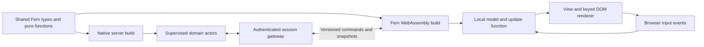

# Full-stack Fern: actors and a reactive WebAssembly client

Date: 2026-09-12. Decision124 adopts this direction; Decision125 records the first
implemented foundations. This document is the full architecture and acceptance
plan. The [web preview guide](WEB_PREVIEW.md) describes what runs today; the earlier
[Rust workspace acceptance](RUST_WORKSPACE.md) records the native migration scope.

## Product direction

Build a coherent alternative for applications that would otherwise use
Elixir/Phoenix: native Fern actors own server state, Fern compiled to WebAssembly
owns browser interaction and rendering, and typed messages connect the two over
WebSocket. Keep the small native CLI use case supported.

The application author writes Fern and shares suitable data types and pure
functions between targets. Compiler, runtime, browser host, renderer and build
tooling remain Rust-authored. A first-party web/UI framework owns routing,
components and application conventions; these do not become special cases in
the language type checker or mandatory dependencies of every CLI executable.

Phoenix LiveView retains state on the server and updates the browser through its
rendering protocol. Fern's selected starting model puts a reactive UI program in
the browser, exchanging application data with the server. This is a different
rendering architecture with a similar goal of one coherent development experience.
See [LiveView's lifecycle](https://hexdocs.pm/phoenix_live_view/Phoenix.LiveView.html).

Shared source does not imply shared memory, shared authority or remote function
calls. Native actor messages, browser events and network messages have different
ownership and delivery contracts.

## Implemented preview boundary

The collaborative checklist runs its complete typed domain, local model,
event update and keyed view in compiled Fern. A generic Rust browser host supplies
DOM, storage and transport capabilities. On the server, a native compiled Fern
actor owns each room, reached through explicitly rooted host sessions and typed
reply ports on pinned owner threads. Stable room placement shares global
admission and resource limits across configurable workers; a separate
authentication owner can revoke queued work while a room is busy. Optional local
room checkpoints commit through one shared Rust writer before acknowledgement
and restore into actors under fresh incarnations. See the
[worker contract](WEB_WORKERS.md) for the implemented concurrency boundary.

The bounded command/snapshot protocol implements revision conflicts, sequence
high-water marks, retained duplicate outcomes, distinct resource/namespace/socket
identities, expiry and reset handling. The transport adds authentication, Origin
and CSRF checks, revocation, bounded admission/queues and socket deadlines. Offline
loading restores cached assets, confirmed state and a local draft; shared changes
require connectivity and uncertain mutations are not blindly replayed.

`cargo xtask web-build` embeds all browser assets and dependency notices in a
server executable. ARM64 Linux musl execution has been exercised unprivileged in
an empty chroot with two real browser clients, including offline reload and
reconnect. x86-64 musl ELF structure has been validated, without x86-64 execution.
These checks establish a useful preview, not all acceptance cases below.
The final macOS browser acceptance additionally passed cold service-worker restart,
offline draft/filter recovery, 320-pixel mobile layout and rejection of a tampered
HTTP-200 asset update while retaining the prior offline cache. Fresh macOS native
quality checks and equivalent Linux coverage across resumed runs also passed;
the [verification record](WEB_PREVIEW.md#verification) gives their exact scope.

Separately, native Fern actors now own payload heaps and copy message/capture
graphs. Compiler root frames and scoped runtime roots are explicit, while ordinary
native collection still conservatively scans stack/register state and heap words.
The WASM backend branches from semantic IR and supports bounded records, tagged
sums, lists, tuples, Option/Result and UTF-8 strings with precise child tracing.
Managed host values use type-checked, nonwrapping i64/BigInt handles. Native and
browser modules share source, not linear memory. Maps, closures, indirect calls,
native capabilities, generic wire-schema generation and application-independent
packaging remain open. See [memory management](MEMORY_MANAGEMENT.md).

## Decisions to preserve while implementing

### Automatic memory with explicit ownership inside the runtime

Do not introduce mandatory borrow checking, move syntax or lifetime annotations
into ordinary Fern application code. For this actor-oriented workload, prioritize
isolation and bounded scheduling over replacing all collection with reference
counting. Inferred ownership, borrowing and allocation reuse remain internal
optimizations, subject to semantic and performance tests.

The server target is **actor-owned tracing heaps**, initially nonmoving with
precise roots. A collector for one actor must not trace another actor's heap.
Every suspended continuation, mailbox and native handle has a known owner and a
defined cleanup path. Actor termination releases its heap and closes/cancels
owned resources; GC finalization is not a substitute for reliable resource close.

Messages and spawned captures must be copied into receiver-owned storage, or into
an owned message fragment that the receiver adopts. Preserve sharing within the
copied graph, enforce deterministic traversal/byte bounds, and publish only a
complete copy. Allocation failure must leave both actors' observable state intact.
Ordinary actors cannot retain pointers into another actor's heap. A later shared
immutable binary facility may use reference counting with explicit accounting;
this is an optimization, not a prerequisite for the first implementation.

This choice draws on Erlang's use of process-local tracing heaps and its separation
of ordinary message copying from shared large binaries. It does not adopt every
BEAM collector detail. [Erlang GC](https://www.erlang.org/doc/apps/erts/garbagecollection.html),
[message ownership](https://www.erlang.org/doc/system/eff_guide_processes.html#sending-messages).

Per-actor heaps alone do not guarantee low latency. Collection, allocation,
message copying and mailbox searches must be charged to explicit work budgets.
Start with bounded heaps and measure worst-case collection; incremental or
generational collection requires its own evidence. Do not advertise pause-free
execution or a hard real-time guarantee.

### Fair execution before multicore claims

Native actor code must yield through compiler-defined safepoints, with a work
budget analogous in purpose to reductions. Loops, recursion and actor-reachable
helper calls must preserve all live state in resumable continuations. A poll that
cannot suspend the call chain is not a fairness mechanism. Root information must
be valid at every allocation, yield and callback boundary.

Readiness-driven network IO wakes actors through an external event loop. A server
waiting for registered external events is idle, not deadlocked. Unavoidable
blocking file, database and process work runs in a bounded worker facility. Such
jobs exchange Rust-owned requests/results, never borrowed Fern heap pointers.
Cancellation and late completion must respect actor identity generations.

Prove isolation and fairness on one scheduler worker first. Then pin actors to
multiple workers with single execution ownership and owned cross-worker messages.
Migration and work stealing come later, after suspended heaps and continuations
can transfer safely. Do not add `Send` implementations around the current TLS heap
or hold a global runtime lock across IO as a shortcut to parallelism.

### Typed supervision and durable state are separate contracts

Supervision must wrap the actors that actually execute typed Fern functions.
Define child startup, failure, cancellation, restart policy, restart intensity,
subtree shutdown and fresh identity explicitly. Recoverable actor failures do not
stop unrelated actors. Ordinary recoverable native-runtime faults must propagate
through actor failure handling. Generated checked source calls already carry an
actor fault cell; legacy unchecked `abi::fault` entry points can still terminate
the process. A supervisor cannot recover after the whole process has exited.
Runtime corruption or an unsafe implementation defect may
still terminate the OS process; native actors are not security sandboxes.

Restart reconstructs state from a declared initializer or durable store. It does
not resurrect the previous heap or make effects exactly once. Durable mutation,
acknowledgement and deduplication need an application transaction boundary.
[Elixir supervision](https://hexdocs.pm/elixir/Supervisor.html) is a behavioral
reference, not evidence that those guarantees exist in Fern today.

### A browser target with its own ABI

Share the parser, checker, semantic type identities and portable typed IR. Branch
the WebAssembly backend before native lowering erases pointers, handles and
callback identities into 64-bit words. Cranelift remains the native backend;
targeting browsers requires a separate WebAssembly emitter.

The initial implementation target is **wasm32 linear memory with a small precise
tracing runtime and compiler-maintained roots**. Keep language `Int` as i64 while
making pointer width, layout, alignment and handle representation target-specific.
Do not truncate native addresses or copy native ABI records into browser memory.
Calls use validated function/table identities rather than native code addresses.

Native stack/register scanning cannot supply browser roots. Keep every live
managed reference visible to the browser collector across allocations, callbacks
and event-loop yields. Start with one browser execution context and bounded event
processing; workers and shared browser memory require separate acceptance.

WasmGC is a real alternative to evaluate using the same programs. It is not
rejected as unavailable, and it is not the initial backend dependency. The choice
must be revisited if bundle size, pause time or interop measurements show an
advantage sufficient to justify a different representation. Compare both before
stabilizing the browser ABI. Automatic memory semantics should remain stable
across targets even when collectors differ.
[WebAssembly feature status](https://webassembly.org/features/) and
[WebAssembly 3.0](https://webassembly.org/news/2025-09-17-wasm-3.0/).

Prove how generated Fern code calls the Rust browser runtime early: a versioned
module import/export boundary may precede single-module packaging. There must be
one explicit memory/allocator owner, nonoverlapping static-data regions and tested
initialization order. A general WebAssembly linker is not a prerequisite for the
first UI. The native static archive is not a browser runtime artifact.

Browser APIs require host imports. A Rust-authored browser host and generated
bindings provide DOM, events, timers, networking and asset loading. Generated
JavaScript loading/interop glue is a build artifact; handwritten JavaScript is
not part of Fern's implementation or application-author workflow. This does not
restore the removed Tree-sitter integration. WASI is not a substitute for browser
DOM integration. [WebAssembly browser embedding](https://webassembly.org/docs/web/).

Host handles have explicit lifetime and release rules. Unmount must remove event
subscriptions and release DOM references so cross-language cycles do not retain
an application indefinitely. Never retain a stale view into linear memory across
memory growth. Browser-unavailable APIs such as native filesystem/process APIs
and SQLite native handles must be rejected by target capability checking, even
in imported modules reached indirectly from the application.

### A local reactive UI and an authoritative server

Start with an explicit model/update/view architecture: browser events and server
messages update immutable local state, and a keyed renderer updates the DOM.
Effects run through explicit commands. Typing, focus and local validation must
remain responsive without a network round trip. Server-owned business state is
authoritative; client state may contain drafts, selections and pending commands.

Use ordinary accessible DOM elements, preserve focus and text selection, and
release handlers on unmount. Do not require a canvas-only UI. The first version
uses confirmed server state rather than optimistic durable mutations; later
optimism needs reconciliation rules. Routing, server rendering/hydration and
fine-grained reactive optimizations follow the first functional client.

### A typed wire protocol, not remote actor pointers

The server validates every browser message against the authenticated principal
and selected resource. Shared types improve development but do not make the
network trustworthy. Never serialize heap addresses, closures, native handles
or local PIDs. A session gateway maps authorized requests to domain actors.

Start with bounded, versioned JSON command/snapshot envelopes. Generate both
ends' wire codecs from an explicitly supported shared type subset. This is a
separate wire contract, not a silent change to ordinary `derive(Json)` behavior.
Use canonical decimal strings for full-width integers and revisions so browser
host code cannot round them through JavaScript numbers; reject nonfinite floats.
Test malformed, oversized, recursive and schema-incompatible messages before effects.

Keep three identities distinct: server/resource incarnation, resumable client
command namespace, and physical connection generation. Reconnect negotiates the
protocol and reauthorizes access; it may resume a still-valid command namespace
but always obtains a fresh connection generation and snapshot. Commands carry
the resource incarnation, expected revision and monotonic client sequence;
snapshots carry incarnation and revision. Ordering is per resource, not global.
Within one incarnation, clients ignore stale revisions; complete snapshots can
safely skip intermediate revisions. A later delta protocol must request a
snapshot when its required base revision is missing. Protocol mismatches require
a visible upgrade/reload response.

WebSocket delivery within one connection does not provide exactly-once effects
across reconnects. Start with one outstanding mutation per client command
namespace. Retain a sequence high-water mark and bounded recent outcomes;
requests at or below the mark can never execute again, even after their cached
outcome expires. Reject reuse of a retained command ID with a different payload.
After authorization, resolve duplicate outcomes before testing expected revision.
An expired outcome yields an explicit unknown result and resync. Expired
server-issued namespaces are invalid; they cannot be recreated by client input.
Automatic retry after a process restart requires durable idempotency information
committed with the mutation. Otherwise report uncertain completion and refresh
state without blindly retrying a non-idempotent command.

An ephemeral domain actor restart creates a new resource incarnation even when
the server and socket remain alive. Gateways invalidate its old outcome cache;
clients accept an explicit reset, replace state and invalidate pending commands
from the old incarnation. A restarted server also invalidates old client command
namespaces. Neither reset silently replays mutations into the replacement state.

Bound per-connection input, queued commands, output bytes and subscriptions.
Also impose process-wide admission limits on handshakes, connections, rooms,
queued bytes and retained resumable-session/deduplication metadata. Expire retained
metadata explicitly and expose overload rejection; connection churn cannot evade
aggregate limits.
Coalesce replaceable snapshots; never discard command outcomes as if they were
snapshots. Slow consumers are resynchronized or disconnected under documented
limits. Enforce browser output thresholds as well as server queues. Define heartbeat
expiry, reconnect backoff with jitter and reconnect-storm admission limits.
Authenticate the upgrade, validate browser origins and authorize
each resource operation; cookie-authenticated upgrades need CSRF protection and
active sessions must react to revocation. Use WSS outside loopback development.
Cancellation and disconnect close socket resources and subscriptions. Bounded
resumable command metadata survives disconnect only until its declared expiry;
logout/revocation invalidates its namespace.

### Scale in stages

One node must first demonstrate sustained work on multiple cores with bounded
memory and fair progress. Shard state by room, tenant or another explicit key;
one hot actor still serializes its work. [Fixed multi-node placement and routing](CLUSTER.md)
now connect gateways to native room owners through authenticated TLS. Local
checkpoint recovery and explicit uncertain completion are tested across real
processes. Dynamic ownership epochs, replicated failover and distributed recovery
remain separate milestones. A WebSocket connection is not durable application state.

Embedded SQLite remains useful for local/single-node state. Adding server nodes
does not turn independent SQLite files into a shared transactional database.
The deployment model must choose partitioned local ownership or a suitable shared
durable store before claiming transparent horizontal scaling.

Record actor identity/generation, trace and command IDs, mailbox depth, rejected
work, scheduler delay, heap/GC work, restart counts, socket backlog and reconnects.
No speed, connection-count or Phoenix parity claim is accepted without a pinned
workload, hardware description and latency/memory distributions.

Measure compiler latency and generated server executable size separately from
runtime performance. For browser builds, report compressed WASM plus required
glue/assets, cold load to usable UI, local input latency, GC pauses and memory
after repeated mount/unmount. For the full stack, record acknowledged-command
latency and throughput under slow clients, reconnects and a saturated actor.
Compare with Phoenix using the same application behavior and resource limits;
native code or WebAssembly alone is not evidence of a faster user experience.

## Current gaps and complete Fern application delivery

Actor-owned payload heaps and copied messages are implemented. Native callbacks
still run cooperatively. Eligible recursive Unit-tail paths yield through rooted
continuations; numeric/non-tail calls and collection loops remain synchronous.
Opt-in typed supervision restarts supported checked faults while unsupervised
faults can stop their invocation. Reusable slots preserve immutable generations
and stale-PID semantics. Rooted native host sessions can remain idle for external
input. General preemption, complete precise root/layout coverage and bounded
blocking-service scheduling remain open. See
[current actor contracts](RUST_ACTORS.md).

The **two-browser collaborative checklist** now executes its compiled domain
actor and complete Fern model/update/view. Pinned worker threads own independent
room runtimes behind authorized gateways. The process shares admission and
resource limits, and optionally commits room checkpoints before acknowledgement.
Server or domain-actor restart creates a fresh incarnation; configured durable
state is restored, while pending commands are not automatically replayed into
the new incarnation. Transactional external effects and multi-node durable
ownership remain later gates. The application-specific wire schema and build
paths still need a general framework contract and packaging API.

Implementation gates are ordered in the [roadmap](../ROADMAP.md). Browser and
server foundations can progress independently after shared type/layout contracts.
Independent room-worker progress does not establish general actor preemption,
work stealing or distributed execution. Sustained scaling retains its own gate.

The complete Fern demo is accepted only when real browser tests demonstrate
all of the following. The current preview covers part of this list; protocol unit
tests do not replace real typed-actor failure or aggregate browser ABI acceptance:

1. Both browser instances agree after concurrent commands, with independent
   expected state and no lost acknowledged updates.
2. Local typing stays responsive during delayed, disconnected or reconnecting
   transport. State-changing commands are visibly pending/rejected, not silently lost.
3. Duplicate commands, expired outcomes/namespaces, stale revisions, reconnects
   and incompatible versions produce the declared outcomes. Server and domain
   actor restart explicitly declare reset; neither pretends an acknowledgement
   persisted when it did not.
4. Invalid/oversized/unauthorized input has no application effects. A slow consumer
   cannot create unbounded mailboxes, browser queues or server output buffers.
   Reconnect churn respects aggregate session and retained-metadata limits.
5. Actor failure and session teardown preserve unrelated work, release handles
   and respect restart budgets. Browser unmount/reload releases subscriptions.
6. Target ABI and wire tests preserve i64 extremes, Unicode, tagged values and
   nested collections; GC under pressure preserves suspended and shared values.
7. Browser output is compiled Fern WebAssembly, with Rust-authored host support,
   reproducible generated glue and execution tests of the generated module.

Later release gates add sustained multi-worker churn, fair progress during CPU
and blocking-IO pressure, stable memory, network disruption and durable failover.
Budget values must be fixed alongside their independent tests before each gate
is marked complete; the current native quotas are not inherited as web defaults.
